# Custos — Architecture

> How every piece fits together, why each decision was made, and what stays private at every layer.

---

## System Overview

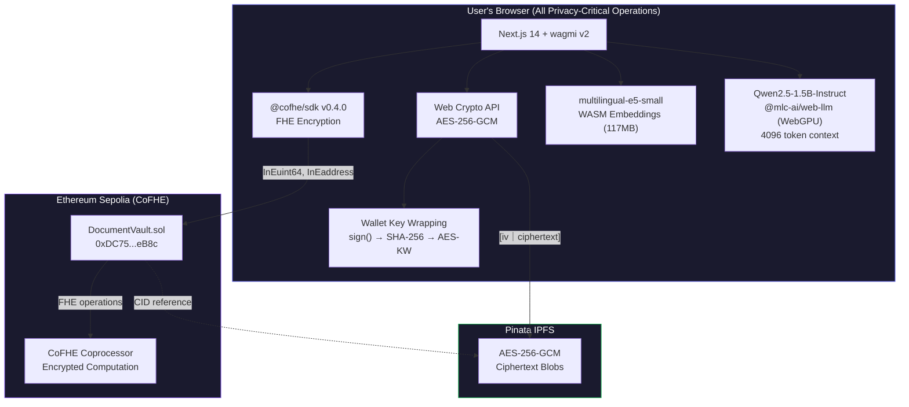
```mermaid
graph TB
    subgraph Browser["User's Browser (All Privacy-Critical Operations)"]
        UI["Next.js 14 + wagmi v2"]
        FHE_SDK["@cofhe/sdk v0.4.0<br/>FHE Encryption"]
        AES["Web Crypto API<br/>AES-256-GCM"]
        E5["multilingual-e5-small<br/>WASM Embeddings (117MB)"]
        CRYPTO["Wallet Key Wrapping<br/>sign() → SHA-256 → AES-KW"]
        WEBLLM["Qwen2.5-1.5B-Instruct<br/>@mlc-ai/web-llm (WebGPU)<br/>4096 token context"]
    end

    subgraph Ethereum["Ethereum Sepolia (CoFHE)"]
        VAULT["DocumentVault.sol<br/>0xDC75...eB8c"]
        COFHE["CoFHE Coprocessor<br/>Encrypted Computation"]
    end

    subgraph IPFS["Pinata IPFS"]
        BLOB["AES-256-GCM<br/>Ciphertext Blobs"]
    end

    UI --> FHE_SDK
    UI --> AES
    UI --> E5
    UI --> WEBLLM
    AES --> CRYPTO
    FHE_SDK -->|"InEuint64, InEaddress"| VAULT
    AES -->|"[iv｜ciphertext]"| BLOB
    VAULT -->|"FHE operations"| COFHE
    VAULT -.->|"CID reference"| BLOB

    style Browser fill:#1a1a2e,stroke:#6366f1,color:#fff
    style Ethereum fill:#1a1a2e,stroke:#8b5cf6,color:#fff
    style IPFS fill:#1a1a2e,stroke:#22c55e,color:#fff
```

---

## Data Flow: Upload Document

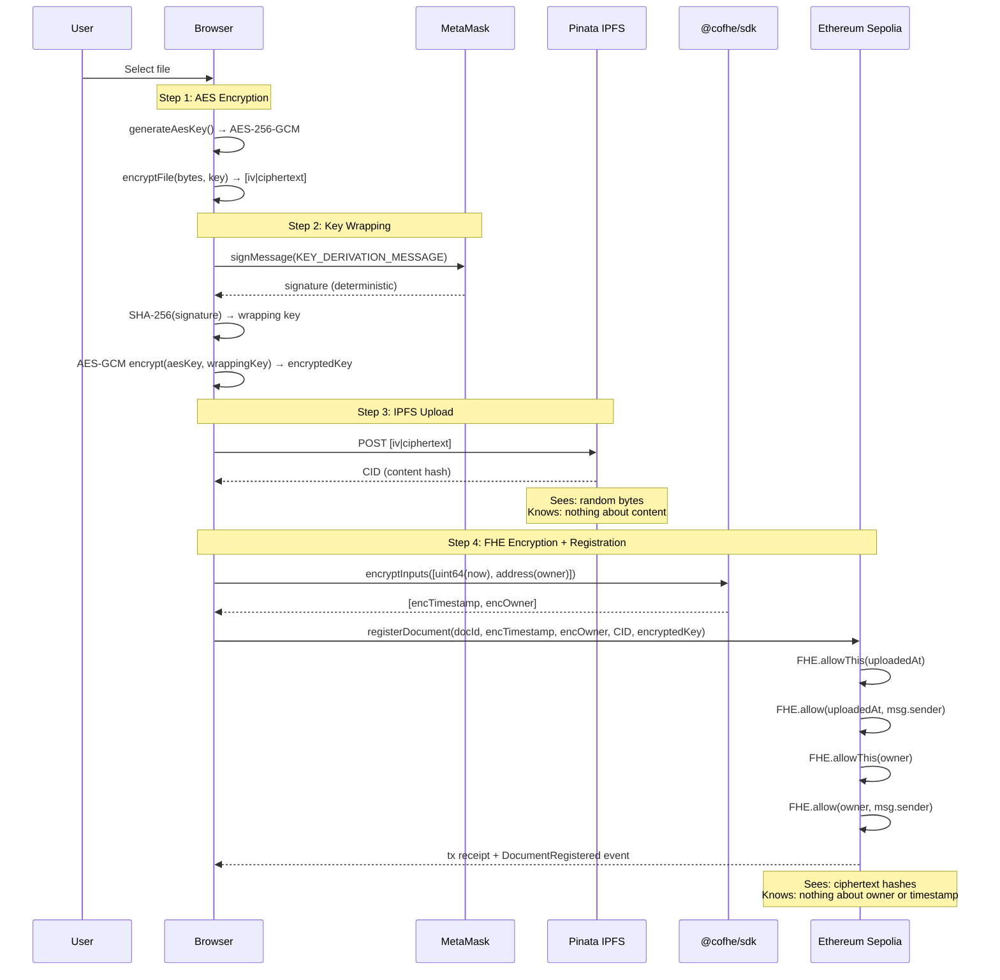
```mermaid
sequenceDiagram
    participant User
    participant Browser
    participant MetaMask
    participant Pinata as Pinata IPFS
    participant CoFHE as @cofhe/sdk
    participant Sepolia as Ethereum Sepolia

    User->>Browser: Select file
    
    Note over Browser: Step 1: AES Encryption
    Browser->>Browser: generateAesKey() → AES-256-GCM
    Browser->>Browser: encryptFile(bytes, key) → [iv|ciphertext]
    
    Note over Browser,MetaMask: Step 2: Key Wrapping
    Browser->>MetaMask: signMessage(KEY_DERIVATION_MESSAGE)
    MetaMask-->>Browser: signature (deterministic)
    Browser->>Browser: SHA-256(signature) → wrapping key
    Browser->>Browser: AES-GCM encrypt(aesKey, wrappingKey) → encryptedKey

    Note over Browser,Pinata: Step 3: IPFS Upload
    Browser->>Pinata: POST [iv|ciphertext]
    Pinata-->>Browser: CID (content hash)
    Note over Pinata: Sees: random bytes<br/>Knows: nothing about content

    Note over Browser,Sepolia: Step 4: FHE Encryption + Registration
    Browser->>CoFHE: encryptInputs([uint64(now), address(owner)])
    CoFHE-->>Browser: [encTimestamp, encOwner]
    Browser->>Sepolia: registerDocument(docId, encTimestamp, encOwner, CID, encryptedKey)
    Sepolia->>Sepolia: FHE.allowThis(uploadedAt)
    Sepolia->>Sepolia: FHE.allow(uploadedAt, msg.sender)
    Sepolia->>Sepolia: FHE.allowThis(owner)
    Sepolia->>Sepolia: FHE.allow(owner, msg.sender)
    Sepolia-->>Browser: tx receipt + DocumentRegistered event

    Note over Sepolia: Sees: ciphertext hashes<br/>Knows: nothing about owner or timestamp
```

---

## Data Flow: FHE Access Check

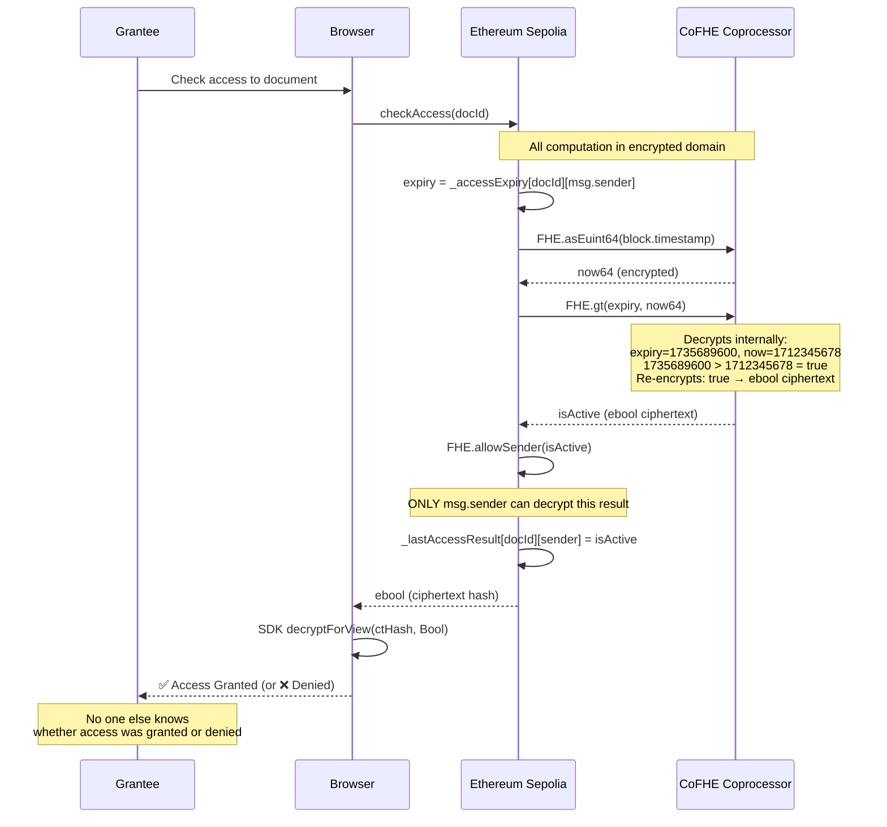
```mermaid
sequenceDiagram
    participant Grantee
    participant Browser
    participant Sepolia as Ethereum Sepolia
    participant CoFHE as CoFHE Coprocessor

    Grantee->>Browser: Check access to document
    Browser->>Sepolia: checkAccess(docId)
    
    Note over Sepolia,CoFHE: All computation in encrypted domain
    Sepolia->>Sepolia: expiry = _accessExpiry[docId][msg.sender]
    Sepolia->>CoFHE: FHE.asEuint64(block.timestamp)
    CoFHE-->>Sepolia: now64 (encrypted)
    Sepolia->>CoFHE: FHE.gt(expiry, now64)
    
    Note over CoFHE: Decrypts internally:<br/>expiry=1735689600, now=1712345678<br/>1735689600 > 1712345678 = true<br/>Re-encrypts: true → ebool ciphertext
    
    CoFHE-->>Sepolia: isActive (ebool ciphertext)
    Sepolia->>Sepolia: FHE.allowSender(isActive)
    Note over Sepolia: ONLY msg.sender can decrypt this result
    Sepolia->>Sepolia: _lastAccessResult[docId][sender] = isActive
    Sepolia-->>Browser: ebool (ciphertext hash)
    
    Browser->>Browser: SDK decryptForView(ctHash, Bool)
    Browser-->>Grantee: ✅ Access Granted (or ❌ Denied)

    Note over Grantee: No one else knows<br/>whether access was granted or denied
```

---

## Data Flow: Grant & Revoke Access

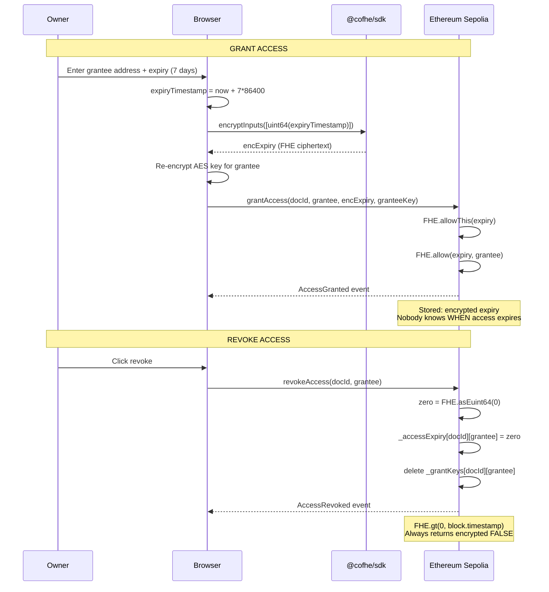
```mermaid
sequenceDiagram
    participant Owner
    participant Browser
    participant CoFHE as @cofhe/sdk
    participant Sepolia as Ethereum Sepolia

    Note over Owner,Sepolia: GRANT ACCESS
    Owner->>Browser: Enter grantee address + expiry (7 days)
    Browser->>Browser: expiryTimestamp = now + 7*86400
    Browser->>CoFHE: encryptInputs([uint64(expiryTimestamp)])
    CoFHE-->>Browser: encExpiry (FHE ciphertext)
    Browser->>Browser: Re-encrypt AES key for grantee
    Browser->>Sepolia: grantAccess(docId, grantee, encExpiry, granteeKey)
    Sepolia->>Sepolia: FHE.allowThis(expiry)
    Sepolia->>Sepolia: FHE.allow(expiry, grantee)
    Sepolia-->>Browser: AccessGranted event
    Note over Sepolia: Stored: encrypted expiry<br/>Nobody knows WHEN access expires

    Note over Owner,Sepolia: REVOKE ACCESS
    Owner->>Browser: Click revoke
    Browser->>Sepolia: revokeAccess(docId, grantee)
    Sepolia->>Sepolia: zero = FHE.asEuint64(0)
    Sepolia->>Sepolia: _accessExpiry[docId][grantee] = zero
    Sepolia->>Sepolia: delete _grantKeys[docId][grantee]
    Sepolia-->>Browser: AccessRevoked event
    Note over Sepolia: FHE.gt(0, block.timestamp)<br/>Always returns encrypted FALSE
```

---

## Data Flow: AI Query with Audit Trail

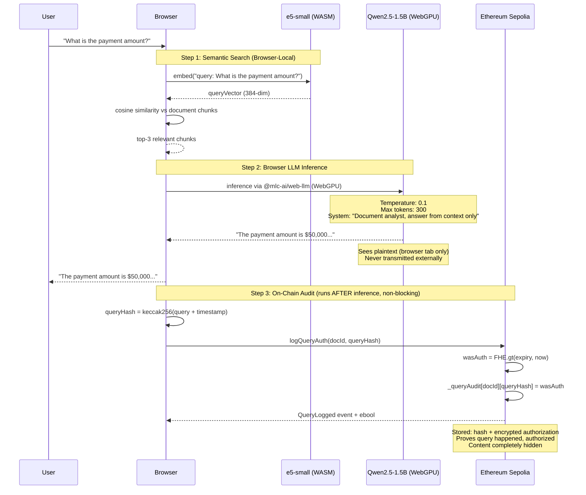
```mermaid
sequenceDiagram
    participant User
    participant Browser
    participant E5 as e5-small (WASM)
    participant WebLLM as Qwen2.5-1.5B (WebGPU)
    participant Sepolia as Ethereum Sepolia

    User->>Browser: "What is the payment amount?"
    
    Note over Browser,E5: Step 1: Semantic Search (Browser-Local)
    Browser->>E5: embed("query: What is the payment amount?")
    E5-->>Browser: queryVector (384-dim)
    Browser->>Browser: cosine similarity vs document chunks
    Browser-->>Browser: top-3 relevant chunks

    Note over Browser,WebLLM: Step 2: Browser LLM Inference
    Browser->>WebLLM: inference via @mlc-ai/web-llm (WebGPU)
    Note over WebLLM: Temperature: 0.1<br/>Max tokens: 300<br/>System: "Document analyst, answer from context only"
    WebLLM-->>Browser: "The payment amount is $50,000..."
    Note over WebLLM: Sees plaintext (browser tab only)<br/>Never transmitted externally

    Browser-->>User: "The payment amount is $50,000..."

    Note over Browser,Sepolia: Step 3: On-Chain Audit (runs AFTER inference, non-blocking)
    Browser->>Browser: queryHash = keccak256(query + timestamp)
    Browser->>Sepolia: logQueryAuth(docId, queryHash)
    Sepolia->>Sepolia: wasAuth = FHE.gt(expiry, now)
    Sepolia->>Sepolia: _queryAudit[docId][queryHash] = wasAuth
    Sepolia-->>Browser: QueryLogged event + ebool
    Note over Sepolia: Stored: hash + encrypted authorization<br/>Proves query happened, authorized<br/>Content completely hidden
```

---

## AI Pipeline Detail: How Document Q&A Works

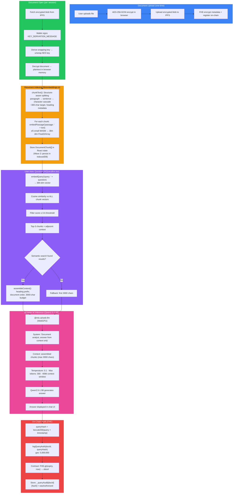
```mermaid
graph TD
    subgraph Upload["Document Upload (one-time)"]
        A1["User uploads file"] --> A2["AES-256-GCM encrypt in browser"]
        A2 --> A3["Upload encrypted blob to IPFS"]
        A3 --> A4["FHE-encrypt metadata + register on-chain"]
    end

    subgraph Open["Document Open (per session)"]
        B1["Fetch encrypted blob from IPFS"] --> B2["Wallet signs KEY_DERIVATION_MESSAGE"]
        B2 --> B3["Derive wrapping key → unwrap AES key"]
        B3 --> B4["Decrypt document → plaintext in browser memory"]
    end

    subgraph Index["Document Indexing (lib/embeddings.ts)"]
        C1["chunkText(): Structure-aware splitting<br/>paragraph → sentence → character cascade<br/>~300-char target, heading metadata"]
        C1 --> C2["For each chunk: embedPassage('passage: ' + text)<br/>e5-small WASM → 384-dim Float32Array"]
        C2 --> C3["Store DocumentChunk[] in React state<br/>(Wave 3: persist in IndexedDB)"]
    end

    subgraph Query["User Asks Question (AIQueryBox.tsx)"]
        D1["embedQuery('query: ' + question)<br/>→ 384-dim vector"]
        D1 --> D2["Cosine similarity vs ALL chunk vectors"]
        D2 --> D3["Filter score ≥ 0.6 threshold"]
        D3 --> D4["Top-3 chunks + adjacent context"]
        D4 --> D5{"Semantic search found results?"}
        D5 -->|"Yes"| D6["assembleContext(): heading prefix,<br/>document order, 3000-char budget"]
        D5 -->|"No"| D7["Fallback: first 3000 chars"]
    end

    subgraph Inference["Browser AI Inference (Qwen2.5-1.5B)"]
        F1["@mlc-ai/web-llm (WebGPU)"]
        F1 --> F2["System: 'Document analyst, answer from context only'"]
        F2 --> F3["Context: assembled chunks (max 3000 chars)"]
        F3 --> F4["Temperature: 0.1 · Max tokens: 300 · 4096 context window"]
        F4 --> F5["Qwen2.5-1.5B generates answer"]
        F5 --> F6["Answer displayed in chat UI"]
    end

    subgraph Audit["On-Chain Audit (FHE)"]
        E1["queryHash = keccak256(query + timestamp)"]
        E1 --> E2["logQueryAuth(docId, queryHash)<br/>gas: 5,000,000"]
        E2 --> E3["Contract: FHE.gt(expiry, now) → ebool"]
        E3 --> E4["Store: _queryAudit[docId][hash] = wasAuthorized"]
    end

    B4 --> C1
    C3 --> D1
    D6 --> F1
    D7 --> F1
    F6 --> E1

    style Upload fill:#3b82f6,stroke:#2563eb,color:#fff
    style Open fill:#22c55e,stroke:#16a34a,color:#fff
    style Index fill:#f59e0b,stroke:#d97706,color:#000
    style Query fill:#8b5cf6,stroke:#7c3aed,color:#fff
    style Audit fill:#ef4444,stroke:#dc2626,color:#fff
    style Inference fill:#ec4899,stroke:#db2777,color:#fff
```

### Current AI Pipeline State

| Component | Status | What It Does | Notes |
|---|---|---|---|
| **Chunking** | ✅ Working | Structure-aware: paragraph → sentence → character cascade, ~300-char target | Heading detection (markdown, ALL-CAPS, title-case), position metadata |
| **Embedding** | ✅ Working | e5-small WASM, 384-dim vectors, heading-prefixed for better matching | "passage: Eligibility Requirements: You must be..." format |
| **Vector Search** | ✅ Working | Cosine similarity, 0.6 threshold, top-3 results | Returns heading + position metadata for context assembly |
| **Context Assembly** | ✅ Working | assembleContext(): top chunk + adjacent chunks, document order, heading prefix | 3000-char budget (browser) / 4000-char (Ollama fallback) |
| **On-Chain Audit** | ✅ Available | keccak256(query+ts) → FHE-encrypted authorization proof | Disabled per-query (MetaMask UX); capability preserved for batch mode |
| **LLM Inference** | ✅ Working | Qwen2.5-1.5B-Instruct via @mlc-ai/web-llm (WebGPU) | ~1.1GB cached in browser, 4096 token context, 20-60 tok/sec |
| **Document Rendering** | ✅ Working | Multi-format: text (inline), PDF (iframe), images, binary (download) | File type detected via magic bytes |
| **Conversation** | ⚠️ Stateless | Each question independent, no history | Wave 3: message history |
| **Multi-Document** | ❌ Not Yet | Can only search within one document at a time | Wave 4: cross-document search |
| **Multi-Format Parse** | ⚠️ Text Only | PDF/DOCX rendered but not parsed for AI Q&A | Wave 4: PDF text extraction, DOCX parsing |

---

## Smart Contract State Model

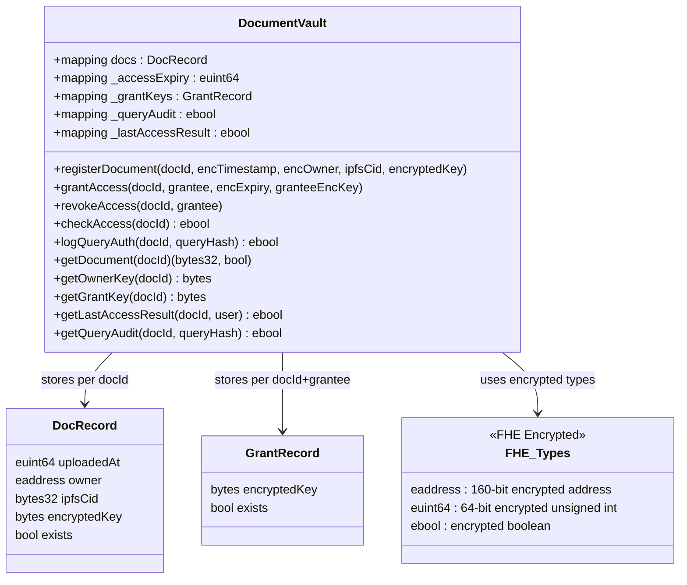
```mermaid
classDiagram
    class DocumentVault {
        +mapping docs : DocRecord
        +mapping _accessExpiry : euint64
        +mapping _grantKeys : GrantRecord
        +mapping _queryAudit : ebool
        +mapping _lastAccessResult : ebool
        +registerDocument(docId, encTimestamp, encOwner, ipfsCid, encryptedKey)
        +grantAccess(docId, grantee, encExpiry, granteeEncKey)
        +revokeAccess(docId, grantee)
        +checkAccess(docId) ebool
        +logQueryAuth(docId, queryHash) ebool
        +getDocument(docId) (bytes32, bool)
        +getOwnerKey(docId) bytes
        +getGrantKey(docId) bytes
        +getLastAccessResult(docId, user) ebool
        +getQueryAudit(docId, queryHash) ebool
    }

    class DocRecord {
        euint64 uploadedAt
        eaddress owner
        bytes32 ipfsCid
        bytes encryptedKey
        bool exists
    }

    class GrantRecord {
        bytes encryptedKey
        bool exists
    }

    class FHE_Types {
        <<FHE Encrypted>>
        eaddress : 160-bit encrypted address
        euint64 : 64-bit encrypted unsigned int
        ebool : encrypted boolean
    }

    DocumentVault --> DocRecord : stores per docId
    DocumentVault --> GrantRecord : stores per docId+grantee
    DocumentVault --> FHE_Types : uses encrypted types
```

---

## Privacy Guarantee Model

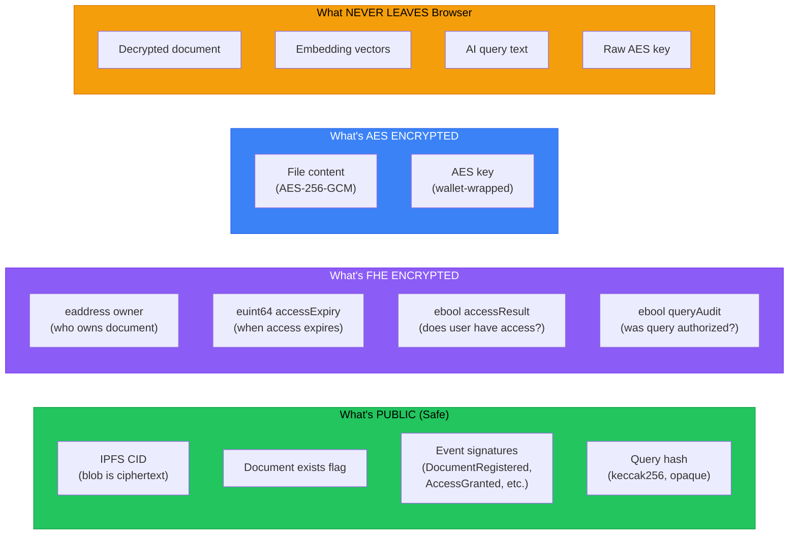
```mermaid
graph LR
    subgraph Public["What's PUBLIC (Safe)"]
        CID["IPFS CID<br/>(blob is ciphertext)"]
        EXISTS["Document exists flag"]
        EVENTS["Event signatures<br/>(DocumentRegistered,<br/>AccessGranted, etc.)"]
        QHASH["Query hash<br/>(keccak256, opaque)"]
    end

    subgraph FHE_Encrypted["What's FHE ENCRYPTED"]
        OWNER["eaddress owner<br/>(who owns document)"]
        EXPIRY["euint64 accessExpiry<br/>(when access expires)"]
        ACCESS["ebool accessResult<br/>(does user have access?)"]
        AUDIT["ebool queryAudit<br/>(was query authorized?)"]
    end

    subgraph AES_Encrypted["What's AES ENCRYPTED"]
        CONTENT["File content<br/>(AES-256-GCM)"]
        KEY["AES key<br/>(wallet-wrapped)"]
    end

    subgraph Local_Only["What NEVER LEAVES Browser"]
        PLAINTEXT["Decrypted document"]
        VECTORS["Embedding vectors"]
        QUERIES["AI query text"]
        AESKEY["Raw AES key"]
    end

    style Public fill:#22c55e,stroke:#16a34a,color:#000
    style FHE_Encrypted fill:#8b5cf6,stroke:#7c3aed,color:#fff
    style AES_Encrypted fill:#3b82f6,stroke:#2563eb,color:#fff
    style Local_Only fill:#f59e0b,stroke:#d97706,color:#000
```

---

## FHE Operation Detail: `checkAccess`

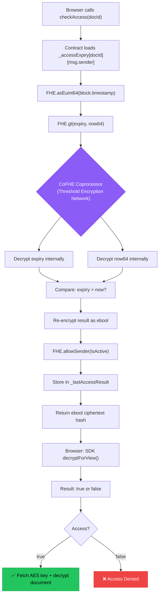
```mermaid
graph TD
    A["Browser calls checkAccess(docId)"] --> B["Contract loads _accessExpiry[docId][msg.sender]"]
    B --> C["FHE.asEuint64(block.timestamp)"]
    C --> D["FHE.gt(expiry, now64)"]
    
    D --> E{"CoFHE Coprocessor<br/>(Threshold Encryption Network)"}
    
    E --> F["Decrypt expiry internally"]
    E --> G["Decrypt now64 internally"]
    F --> H["Compare: expiry > now?"]
    G --> H
    H --> I["Re-encrypt result as ebool"]
    
    I --> J["FHE.allowSender(isActive)"]
    J --> K["Store in _lastAccessResult"]
    K --> L["Return ebool ciphertext hash"]
    
    L --> M["Browser: SDK decryptForView()"]
    M --> N["Result: true or false"]
    
    N --> O{"Access?"}
    O -->|"true"| P["✅ Fetch AES key + decrypt document"]
    O -->|"false"| Q["❌ Access Denied"]

    style E fill:#8b5cf6,stroke:#7c3aed,color:#fff
    style P fill:#22c55e,stroke:#16a34a,color:#000
    style Q fill:#ef4444,stroke:#dc2626,color:#fff
```

---

## Frontend Component Tree

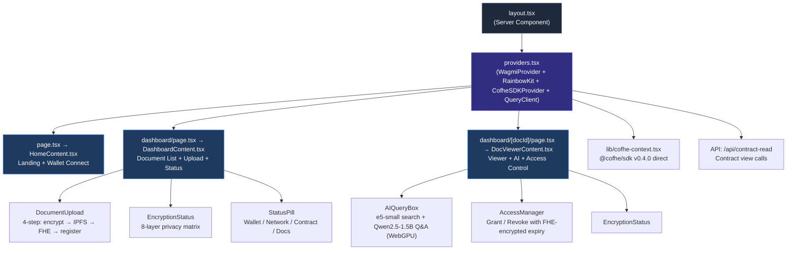
```mermaid
graph TD
    LAYOUT["layout.tsx<br/>(Server Component)"]
    PROVIDERS["providers.tsx<br/>(WagmiProvider + RainbowKit + CofheSDKProvider + QueryClient)"]
    
    LAYOUT --> PROVIDERS
    
    PROVIDERS --> HOME["page.tsx → HomeContent.tsx<br/>Landing + Wallet Connect"]
    PROVIDERS --> DASH["dashboard/page.tsx → DashboardContent.tsx<br/>Document List + Upload + Status"]
    PROVIDERS --> DOC["dashboard/[docId]/page.tsx → DocViewerContent.tsx<br/>Viewer + AI + Access Control"]
    
    DASH --> UPLOAD["DocumentUpload<br/>4-step: encrypt → IPFS → FHE → register"]
    DASH --> STATUS["EncryptionStatus<br/>8-layer privacy matrix"]
    DASH --> PILLS["StatusPill<br/>Wallet / Network / Contract / Docs"]
    
    DOC --> AIBOX["AIQueryBox<br/>e5-small search + Qwen2.5-1.5B Q&A (WebGPU)"]
    DOC --> ACCESS["AccessManager<br/>Grant / Revoke with FHE-encrypted expiry"]
    DOC --> STATUS2["EncryptionStatus"]

    PROVIDERS --> SDK["lib/cofhe-context.tsx<br/>@cofhe/sdk v0.4.0 direct"]
    PROVIDERS --> API2["API: /api/contract-read<br/>Contract view calls"]

    style LAYOUT fill:#1e293b,stroke:#475569,color:#fff
    style PROVIDERS fill:#312e81,stroke:#6366f1,color:#fff
    style HOME fill:#1e3a5f,stroke:#3b82f6,color:#fff
    style DASH fill:#1e3a5f,stroke:#3b82f6,color:#fff
    style DOC fill:#1e3a5f,stroke:#3b82f6,color:#fff
```

---

## Encryption Layers Stack

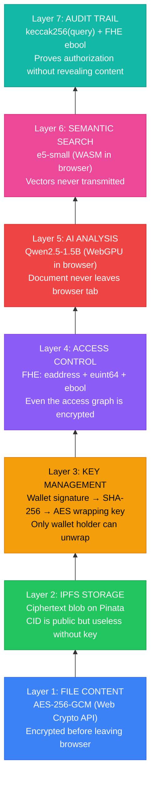
```mermaid
graph BT
    L1["Layer 1: FILE CONTENT<br/>AES-256-GCM (Web Crypto API)<br/>Encrypted before leaving browser"]
    L2["Layer 2: IPFS STORAGE<br/>Ciphertext blob on Pinata<br/>CID is public but useless without key"]
    L3["Layer 3: KEY MANAGEMENT<br/>Wallet signature → SHA-256 → AES wrapping key<br/>Only wallet holder can unwrap"]
    L4["Layer 4: ACCESS CONTROL<br/>FHE: eaddress + euint64 + ebool<br/>Even the access graph is encrypted"]
    L5["Layer 5: AI ANALYSIS<br/>Qwen2.5-1.5B (WebGPU in browser)<br/>Document never leaves browser tab"]
    L6["Layer 6: SEMANTIC SEARCH<br/>e5-small (WASM in browser)<br/>Vectors never transmitted"]
    L7["Layer 7: AUDIT TRAIL<br/>keccak256(query) + FHE ebool<br/>Proves authorization without revealing content"]

    L1 --> L2
    L2 --> L3
    L3 --> L4
    L4 --> L5
    L5 --> L6
    L6 --> L7

    style L1 fill:#3b82f6,stroke:#2563eb,color:#fff
    style L2 fill:#22c55e,stroke:#16a34a,color:#fff
    style L3 fill:#f59e0b,stroke:#d97706,color:#000
    style L4 fill:#8b5cf6,stroke:#7c3aed,color:#fff
    style L5 fill:#ef4444,stroke:#dc2626,color:#fff
    style L6 fill:#ec4899,stroke:#db2777,color:#fff
    style L7 fill:#14b8a6,stroke:#0d9488,color:#fff
```

---

## Competitive Positioning

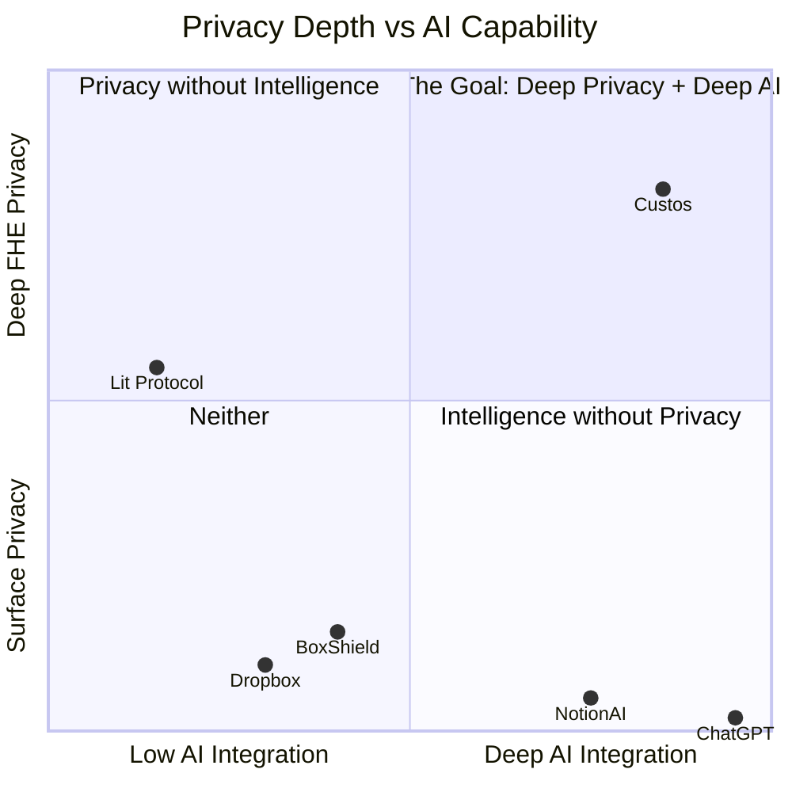
```mermaid
quadrantChart
    title Privacy Depth vs AI Capability
    x-axis "Low AI Integration" --> "Deep AI Integration"
    y-axis "Surface Privacy" --> "Deep FHE Privacy"
    quadrant-1 "The Goal: Deep Privacy + Deep AI"
    quadrant-2 "Privacy without Intelligence"
    quadrant-3 "Neither"
    quadrant-4 "Intelligence without Privacy"

    Custos: [0.85, 0.82]
    Lit Protocol: [0.15, 0.55]
    Dropbox: [0.30, 0.10]
    NotionAI: [0.75, 0.05]
    BoxShield: [0.40, 0.15]
    ChatGPT: [0.95, 0.02]
```

---

## Buildathon Wave Roadmap

> Custos entered the buildathon at Wave 2.

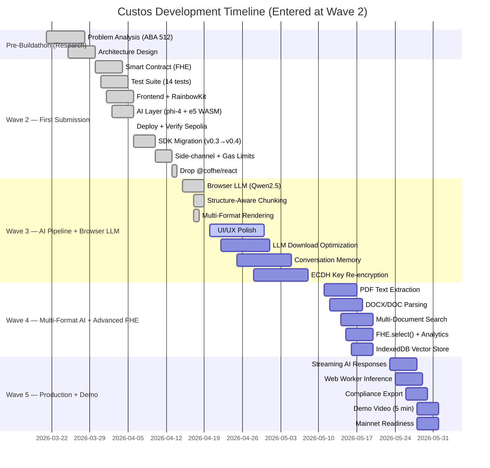
```mermaid
gantt
    title Custos Development Timeline (Entered at Wave 2)
    dateFormat YYYY-MM-DD
    
    section Pre-Buildathon (Research)
    Problem Analysis (ABA 512)  :done, pre1, 2026-03-21, 2026-03-28
    Architecture Design          :done, pre2, 2026-03-25, 2026-03-30
    
    section Wave 2 — First Submission
    Smart Contract (FHE)        :done, w2a, 2026-03-30, 2026-04-04
    Test Suite (14 tests)       :done, w2b, 2026-03-31, 2026-04-05
    Frontend + RainbowKit       :done, w2c, 2026-04-01, 2026-04-06
    AI Layer (phi-4 + e5 WASM)  :done, w2d, 2026-04-02, 2026-04-06
    Deploy + Verify Sepolia     :done, w2e, 2026-04-06, 2026-04-06
    SDK Migration (v0.3→v0.4)   :done, w2f, 2026-04-06, 2026-04-10
    Side-channel + Gas Limits   :done, w2g, 2026-04-10, 2026-04-13
    Drop @cofhe/react           :done, w2h, 2026-04-13, 2026-04-14
    
    section Wave 3 — AI Pipeline + Browser LLM
    Browser LLM (Qwen2.5)      :done, w3a, 2026-04-15, 2026-04-19
    Structure-Aware Chunking    :done, w3b, 2026-04-17, 2026-04-19
    Multi-Format Rendering      :done, w3c, 2026-04-17, 2026-04-18
    UI/UX Polish                :active, w3d, 2026-04-20, 2026-04-30
    LLM Download Optimization   :w3e, 2026-04-22, 2026-05-01
    Conversation Memory         :w3f, 2026-04-25, 2026-05-05
    ECDH Key Re-encryption      :w3g, 2026-04-28, 2026-05-08
    
    section Wave 4 — Multi-Format AI + Advanced FHE
    PDF Text Extraction         :w4a, 2026-05-11, 2026-05-17
    DOCX/DOC Parsing            :w4b, 2026-05-12, 2026-05-18
    Multi-Document Search       :w4c, 2026-05-14, 2026-05-20
    FHE.select() + Analytics    :w4d, 2026-05-15, 2026-05-20
    IndexedDB Vector Store      :w4e, 2026-05-16, 2026-05-20
    
    section Wave 5 — Production + Demo
    Streaming AI Responses      :w5a, 2026-05-23, 2026-05-28
    Web Worker Inference         :w5b, 2026-05-24, 2026-05-29
    Compliance Export           :w5c, 2026-05-26, 2026-05-30
    Demo Video (5 min)          :w5d, 2026-05-28, 2026-06-01
    Mainnet Readiness           :w5e, 2026-05-28, 2026-06-01
```

---

## Design Decisions

### Why FHE instead of ZK-Proofs?

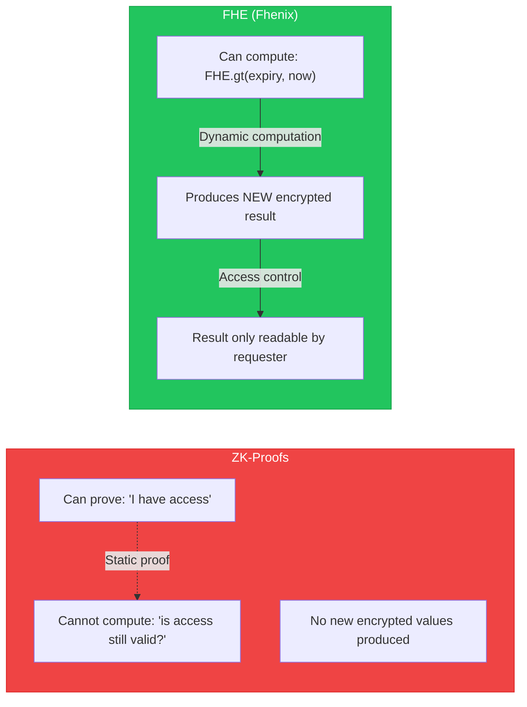
```mermaid
graph LR
    subgraph ZK["ZK-Proofs"]
        ZK1["Can prove: 'I have access'"]
        ZK2["Cannot compute: 'is access still valid?'"]
        ZK3["No new encrypted values produced"]
    end
    
    subgraph FHE_Block["FHE (Fhenix)"]
        FHE1["Can compute: FHE.gt(expiry, now)"]
        FHE2["Produces NEW encrypted result"]
        FHE3["Result only readable by requester"]
    end
    
    ZK1 -.->|"Static proof"| ZK2
    FHE1 -->|"Dynamic computation"| FHE2
    FHE2 -->|"Access control"| FHE3

    style ZK fill:#ef4444,stroke:#dc2626,color:#fff
    style FHE_Block fill:#22c55e,stroke:#16a34a,color:#fff
```

### Why AES for Files + FHE for Access Control?

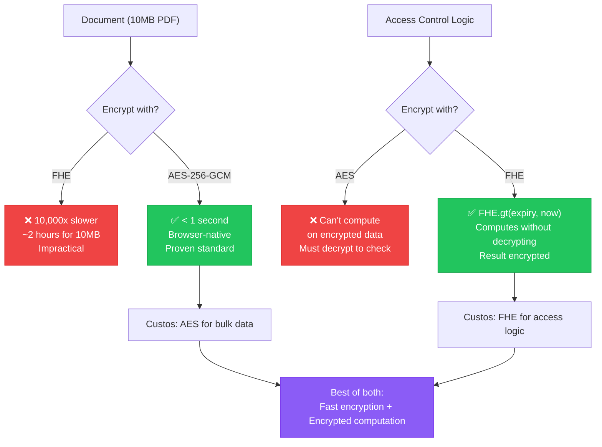
```mermaid
graph TD
    A["Document (10MB PDF)"] --> B{"Encrypt with?"}
    
    B -->|"FHE"| C["❌ 10,000x slower<br/>~2 hours for 10MB<br/>Impractical"]
    B -->|"AES-256-GCM"| D["✅ < 1 second<br/>Browser-native<br/>Proven standard"]
    
    E["Access Control Logic"] --> F{"Encrypt with?"}
    
    F -->|"AES"| G["❌ Can't compute<br/>on encrypted data<br/>Must decrypt to check"]
    F -->|"FHE"| H["✅ FHE.gt(expiry, now)<br/>Computes without decrypting<br/>Result encrypted"]
    
    D --> I["Custos: AES for bulk data"]
    H --> J["Custos: FHE for access logic"]
    I --> K["Best of both:<br/>Fast encryption + Encrypted computation"]
    J --> K

    style C fill:#ef4444,stroke:#dc2626,color:#fff
    style G fill:#ef4444,stroke:#dc2626,color:#fff
    style D fill:#22c55e,stroke:#16a34a,color:#fff
    style H fill:#22c55e,stroke:#16a34a,color:#fff
    style K fill:#8b5cf6,stroke:#7c3aed,color:#fff
```

---

## Security Model

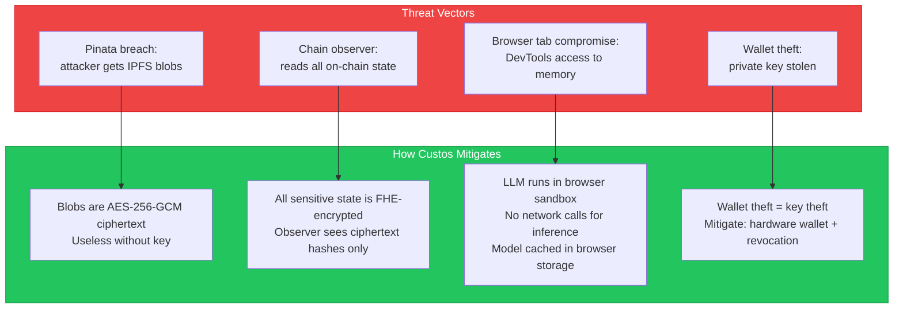
```mermaid
graph TD
    subgraph Threats["Threat Vectors"]
        T1["Pinata breach:<br/>attacker gets IPFS blobs"]
        T2["Chain observer:<br/>reads all on-chain state"]
        T3["Browser tab compromise:<br/>DevTools access to memory"]
        T4["Wallet theft:<br/>private key stolen"]
    end

    subgraph Mitigations["How Custos Mitigates"]
        M1["Blobs are AES-256-GCM ciphertext<br/>Useless without key"]
        M2["All sensitive state is FHE-encrypted<br/>Observer sees ciphertext hashes only"]
        M3["LLM runs in browser sandbox<br/>No network calls for inference<br/>Model cached in browser storage"]
        M4["Wallet theft = key theft<br/>Mitigate: hardware wallet + revocation"]
    end

    T1 --> M1
    T2 --> M2
    T3 --> M3
    T4 --> M4

    style Threats fill:#ef4444,stroke:#dc2626,color:#fff
    style Mitigations fill:#22c55e,stroke:#16a34a,color:#fff
```
